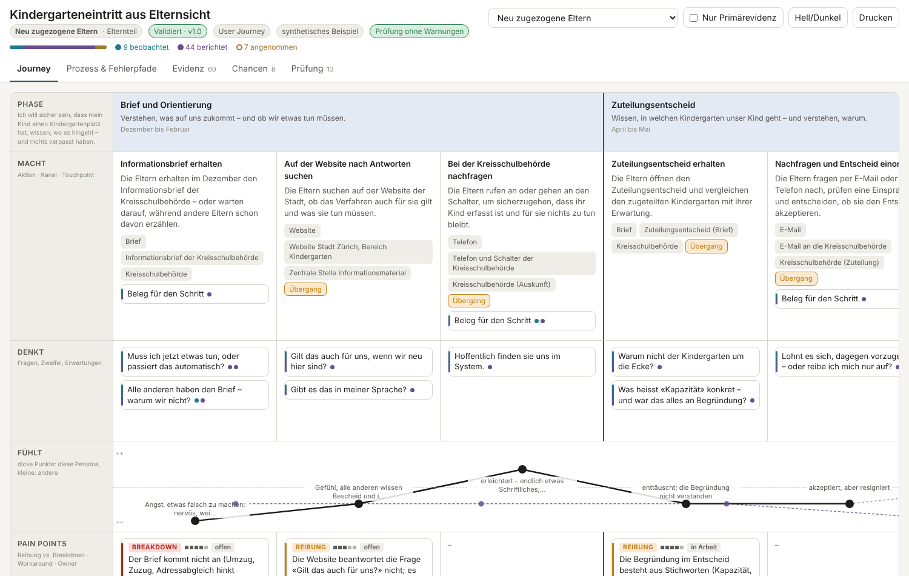

# JourneyKit


> Evidence-based User Journeys for public administration: a JSON model where every claim points to evidence, lints for the known journey-mapping pitfalls, an interactive single-file viewer, and a portable Claude skill that synthesises journeys from raw material.

🇩🇪 [Deutsche Version](README.de.md)

## Overview

Most journey maps are posters: built in a meeting room, biased towards the happy path, never updated, never translated into work. JourneyKit treats a journey as a **data set, not a picture**. The primary artefact is a JSON file (`journey.json`) that holds persona, scenario, phases, steps, pain points, recovery paths, KPIs and opportunities — and every statement in it references **evidence atoms** (quotes, metrics, observations) with a source and an evidence class: *observed*, *reported* or *assumed*. HTML, story map, action list, audit report and version diff are generated from that model.

The vocabulary is translated for public administration, where nobody "converts" or "churns" — people fall back to the phone, the counter, a complaint, or doing nothing. Content is in German (Swiss spelling); schema field names are English.

## Features

- **Journey model** as JSON Schema (draft 2020-12) with evidence atoms, sources, PII status, owner and review cycle
- **Methodological lints** for the five pitfalls — Inside-Out Bias, Happy Path Bias, Static Map Trap, Empathy Vacuum / Overcomplexity, Micro-Level Disconnect — plus Blueprint smell, PII, KPI translation and evidence quality (L001–L102)
- **Interactive viewer**: a self-contained HTML file with five layers — journey map with emotional curve and evidence-backed phase durations on a common scale, process and failure paths, evidence heatmap and source register, impact/effort matrix with user stories, audit — evidence drill-down to the original quote on every cell, a "primary evidence only" filter, multi-persona overlay, light/dark, print, interface in German or French
- **Exports**: Patton story map (Markdown), action list (CSV), opportunity matrix, audit report
- **Diff** between two versions of a journey — what did new evidence change?
- **Claude skill** `user-journey` with three modes: *Synthesis* (raw material → journey), *Workshop* (hypothesis-first with research plan), *Audit* (review an existing journey)
- **Worked examples**: kindergarten entry from the parents' perspective, built from a synthetic input mix (3 interviews, 30 inquiries, a survey, web analytics, an internal process document, workshop notes); and a building permit for a heat pump (applicant and neighbour as two personas) that tests transferability to another domain and documents where the model reaches its limits

### Demo



Open `examples/kindergarteneintritt/journey.html` in a browser for the full interactive version.

## Prerequisites

- Python 3.10+
- `jsonschema` (installed automatically)
- No JavaScript toolchain: the viewer is plain HTML, CSS and JS in one file

## Installation

```bash
git clone https://github.com/malkreide/journeykit.git
cd journeykit
pip install -e ".[dev]"
```

If `journeykit` is not found afterwards (typical for Windows user installations, where pip puts scripts into `%APPDATA%\Python\Python3xx\Scripts`), use `python -m journeykit …` instead — every command below works that way too.

## Usage / Quickstart

```bash
# Validate against the schema
journeykit validate examples/kindergarteneintritt/journey.json

# Methodological lints (ERROR / WARN / INFO)
journeykit lint examples/kindergarteneintritt/journey.json

# Render the interactive viewer (several files = persona comparison)
journeykit render examples/kindergarteneintritt/journey.json \
                  examples/kindergarteneintritt/journey-berufstaetig.json -o journey.html

# Exports
journeykit export examples/kindergarteneintritt/journey.json --format storymap
journeykit export examples/kindergarteneintritt/journey.json --format actions -o massnahmen.csv
journeykit export examples/kindergarteneintritt/journey.json --format audit

# What did user evidence change compared to the workshop hypothesis?
journeykit diff examples/kindergarteneintritt/workshop-hypothese.json \
                examples/kindergarteneintritt/journey.json

# Start a new journey (status: hypothesis)
journeykit new kita-anmeldung --title "Kita-Anmeldung" --persona "Eltern" --role "Elternteil" --goal "Platz sicher haben" -o kita.json
```

## Available Commands

| Command | Description |
|---|---|
| `journeykit validate FILE...` | JSON Schema validation (exit 2 on errors) |
| `journeykit lint FILE... [--strict] [--quiet] [--format json] [--today DATE] [--lang de\|fr]` | Pitfall lints; `--strict` makes warnings fail. Messages in German or French (default: `meta.language` of the file) |
| `journeykit render FILE... [-o OUT] [--title T] [--lang de\|fr]` | Self-contained interactive HTML; multiple files overlay personas. Interface and lint messages in German or French (default: `meta.language` of the first file); journey content stays as it is |
| `journeykit export FILE --format storymap\|actions\|opportunities\|audit [-o OUT]` | Markdown / CSV exports |
| `journeykit diff OLD NEW` | Model changes between versions (exit 1 when there are changes) |
| `journeykit new ID --title --persona --role --goal` | Scaffold a valid journey in status `hypothesis` |
| `journeykit schema` | Print the JSON Schema |

### Lint rules

| Range | Pitfall | Examples |
|---|---|---|
| L001–L003 | Integrity | dangling evidence references, duplicate IDs, contradictory phase duration (min > typical or typical > max) |
| L010–L012 | Inside-Out Bias | experience claims without primary evidence; persona on fewer than 3 primary sources |
| L020–L023 | Happy Path Bias | no breakdowns; phase without friction or edge case; breakdown without recovery path |
| L030–L034 | Static Map Trap | no owner, no review cycle, severe pain point without owner |
| L040–L043 | Empathy Vacuum | steps without feelings or thoughts; emotions without evidence |
| L050–L052 | Overcomplexity | too many phases/steps; no scope exclusions |
| L060–L063 | Micro-Level Disconnect | no opportunities; severe pain point without linked opportunity; no stories |
| L070–L073 | Blueprint smell | no diagnosis; more back-stage notes than steps; most steps carried out by intermediaries instead of the persona |
| L080–L081 | Privacy | source contains PII; e-mail/phone patterns in evidence text |
| L090–L092 | KPIs | none; commercial naming; no leading indicator |
| L100–L102 | Evidence quality | unused atoms; contradictions; primary evidence without locator |

## Using the Claude skill

The skill lives in `skill/user-journey/`. Point Claude at it (Claude Code: the folder is picked up through `CLAUDE.md`; claude.ai: upload the folder as a skill) and describe your material. The skill diagnoses first — *is this a user journey or a service blueprint?* — chooses a mode, registers sources with PII status, extracts evidence atoms with locators, synthesises the model and runs the lints. It refuses to invent emotions, insists on breakdowns and recovery paths, and says plainly when the material only supports a hypothesis map.

## Configuration

None. The viewer has no external dependencies and makes no network requests; rendered HTML files can be shared inside closed networks.

## Project Structure

```
journeykit/
├── src/journeykit/
│   ├── schema/journey.schema.json   # the journey model (single source of truth)
│   ├── model.py                     # index and claim iterator over a journey
│   ├── validate.py                  # JSON Schema validation
│   ├── lint.py                      # pitfall rules L001–L102
│   ├── lint_messages.py             # messages and hints, German and French
│   ├── render.py                    # injects data into the viewer
│   ├── export.py                    # story map, actions CSV, opportunities, audit
│   ├── diff.py                      # version diff
│   ├── cli.py                       # journeykit command
│   └── viewer/viewer.html           # self-contained interactive viewer
├── skill/user-journey/              # Claude skill: SKILL.md + references/
├── examples/kindergarteneintritt/   # worked, synthetic example incl. raw inputs
├── examples/baubewilligung/        # second domain: transferability check and findings
├── docs/                            # concept, architecture decisions, demo image
├── tests/                           # pytest
└── CLAUDE.md                        # entry point for working on this repo with Claude Code
```

## Changelog

See [CHANGELOG.md](CHANGELOG.md)

## Contributing

Contributions are welcome — see [CONTRIBUTING.md](CONTRIBUTING.md).

## Security

Please report vulnerabilities as described in [SECURITY.md](SECURITY.md). Journey files may contain quotes from real people: keep them anonymised (`pii_status`) before sharing.

## License

MIT License — see [LICENSE](LICENSE)

## Author

Hayal Özkan · [malkreide](https://github.com/malkreide)
